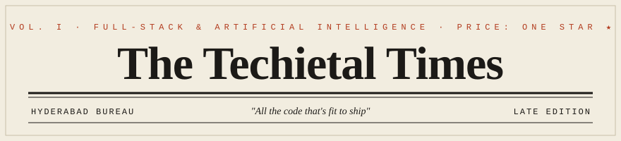

<!-- =========================================================
     THE TECHIETAL TIMES  ·  github.com/Techietal
     Masthead swaps automatically for light / dark visitors.
     ========================================================= -->

<picture>
  <source media="(prefers-color-scheme: dark)" srcset="./assets/masthead-dark.svg">
  <source media="(prefers-color-scheme: light)" srcset="./assets/masthead-light.svg">
  
</picture>

  <em>Silaparasetti Lohith &nbsp;·&nbsp; AI Product Ops &amp; Full-Stack Engineer &nbsp;·&nbsp; Gold Medalist, IIIT Sonepat &nbsp;·&nbsp; Published in Scientific Reports</em>

  
  
  
  
  
  
  

---

## 📰 Front Page

### Engineer Automates the Workflow, Then Comes for the Backlog
> *AI-assisted platforms now handle intake, order processing, and delivery-risk triage. The spreadsheets have filed for unemployment.*

An **AI product operations engineer and 2026 IT graduate** (Gold Medalist, CGPA **9.62**) has spent the year turning operational pain points into production software. Between builds, sources confirm a **73rd-place finish at the ICPC 2025 Kanpur Regionals** and a paper in **Scientific Reports**. Currently shipping AI-enabled workflows at **MAQ Software**, where a patient-intake automation cut per-patient intake time by **66.7%** and lifted clinician capacity by **40%**.

> *"I enjoy building systems that are not just functional, but structured like real enterprise-grade software."*

---

## 🗞️ Choose Your Dispatch

<b>📜 &nbsp;The Recruiter's Edition</b> — the two-minute version

 

AI product-ops-focused software engineer, **2026 B.Tech IT** from **IIIT Sonepat (Gold Medalist, 9.62 CGPA)**. Hands-on building AI-enabled workflows, backend automation, REST APIs, and database-backed systems. Currently at **MAQ Software** (Associate SWE Intern); previously **Accenture**. Microsoft-certified in **AI Agent Builder** and **Fabric Data Engineering**. Competitive programmer (ICPC Kanpur Regionals, rank 73).

**→** [Resume](#) · [LinkedIn](https://www.linkedin.com/in/lohith-silaparasetti-232166260/)

<b>⚙️ &nbsp;The Engineer's Edition</b> — where to start reading

 

**FastAPI + Python** on the backend, **LangGraph / LangChain / ChromaDB** for the agentic and RAG workflows, **PostgreSQL + Redis + Celery + Docker** underneath. Start with the **O2C Agent v2.0** repo for the architecture (JWT, RBAC, async jobs, Dockerized), or **Project Pulse** for LangGraph-based delivery-risk analysis. Issues and nerdy PRs warmly received.

**→** See the Project Desk below.

<b>🎲 &nbsp;The Curiosity Page</b> — a confession

 

**GeminiNote** is the one I'm quietly proud of: an AI note system you chat with over your own uploaded documents. Embeddings, document understanding, a clean interface. Also, yes, I really did rank **73rd at ICPC Kanpur Regionals**, ask me about the problem that got away.

**→** Go poke it in the repos.

---

## 🏛️ On Assignment · Experience

**MAQ Software** — *Associate Software Engineer Intern* · Jan 2026 – Jul 2026
Built AI-enabled **Patient Intake** automation (knowledge retrieval, issue analysis, ticket triage, escalation), cutting per-patient intake time **66.7%** and raising clinician intake capacity **40%**. Shipped maintainable backend modules with API-backed services, SQL-driven data access, and reusable service-layer logic.

**Accenture** — *Advanced Application Engineer Analyst Intern* · Jun 2025 – Jul 2025
Designed enterprise workflow use cases across 3 business-process stages: form-based capture, approval routing, validation logic, and integration-ready automation, with full technical documentation.

---

## 🏗️ From the Project Desk

**🏦 O2C Agent v2.0 — AI Workflow Automation Platform** &nbsp;·&nbsp; *Flagship*
AI-assisted automation for customer onboarding, KYC, order processing, invoice tracking, dispute management, email intake, and human-in-the-loop escalation. **90% automated order processing** across key stages. REST APIs, PostgreSQL data models, JWT auth, RBAC endpoints, async Celery jobs, Redis background processing, Dockerized deploy.
`Python` `FastAPI` `PostgreSQL` `Docker` `Celery` `Redis`
[Source](https://github.com/Techietal/Order-To-Cash-Agent) · [Live Demo](https://main.d27bczp1dlsk6u.amplifyapp.com/)

**📊 Project Pulse — AI Project Health & Delivery-Risk Platform**
Tested on **50+ Azure DevOps work items**, consolidating PRs, pipeline activity, sprint progress, and blockers into a Streamlit dashboard. ChromaDB semantic retrieval + LangGraph analysis to detect risks, summarize blockers, and generate daily pulse reports. 3-level LOW/MEDIUM/HIGH risk scoring.
`Python` `FastAPI` `LangGraph` `ChromaDB` `Azure DevOps API` `Streamlit`
[Source](https://github.com/Techietal/Project-Pulse)

**📝 GeminiNote — Chat-Over-Your-Documents**
An AI note and document-interaction system: embeddings, document understanding, and chat over uploaded content.
`GenAI` `Embeddings` `RAG`
[Source](https://github.com/Techietal/GeminiNote)

**❤️ Effective Heart Disease Prediction**
Hybrid ensemble of XGBoost, SVM, and Random Forest for clinical prediction, focused on accuracy and comparative model evaluation.
`Python` `XGBoost` `SVM` `Random Forest`
[Source](https://github.com/Techietal/Effective-Heart-Disease-prediction-using-hybrid-machine-learning-techniques)

**🧾 Expense Tracker**
An ASP.NET Core MVC expense manager with categories, monthly summaries, and Chart.js visualizations.
`ASP.NET Core` `EF Core` `SQLite` `Bootstrap 5`
[Source](https://github.com/Techietal/Expense-Tracker) · [Live Demo](https://expense-tracker-latest-1n3g.onrender.com/)

<b>More from the archives</b> — TravelUp &amp; Portfolio

 

**✈️ TravelUp** — travel-tech web app: product-oriented frontend/backend and user-centered design.
[Source](https://github.com/Techietal/TravelUp)

**🎨 My Portfolio** — personal site showcasing skills, projects, and technical work.
[Source](https://github.com/Techietal/My-Portfolio) · [Live Site](https://my-portfolio-liart-nine-63.vercel.app/)

---

## 📖 Research & Credentials

- 🏆 **Energy-constrained workflow scheduling for DVFS-enabled heterogeneous systems in cloud computing** — *Scientific Reports (Springer Nature), 2026.* Energy-aware scheduling, makespan optimization on heterogeneous cloud systems.
- 🎓 **Microsoft Certified:** AI Agent Builder Associate · Fabric Data Engineer Associate

---

## 🥇 The Society Pages · Achievements

- 🏅 **Gold Medalist**, Information Technology, Batch 2022–2026 — IIIT Sonepat (**CGPA 9.62**)
- 🧩 **ICPC 2025 Kanpur Regionals — Rank 73** · 396th ICPC 2025 Preliminary · 431st ICPC 2024 Preliminary

---

## 🧰 The Toolshed

**AI & Workflows** &nbsp; LangGraph · LangChain · RAG · Semantic Retrieval · ChromaDB · AI Workflow Automation
**Languages** &nbsp; Python · C++ · SQL · JavaScript · Java
**Backend & APIs** &nbsp; FastAPI · REST · Node.js · Swagger/OpenAPI · JWT · RBAC
**Databases** &nbsp; PostgreSQL · SQLite · MySQL · MongoDB · Redis · ChromaDB
**Cloud & DevOps** &nbsp; Docker · Docker Compose · Git · GitHub Actions · CI/CD · Azure · AWS
**Frontend & Viz** &nbsp; React · Streamlit · Bootstrap 5 · HTML · CSS

---

## 🐍 The Contribution Almanac

<!-- Generated nightly by GitHub Actions (see .github/workflows/snake.yml). -->
<picture>
  <source media="(prefers-color-scheme: dark)" srcset="https://raw.githubusercontent.com/Techietal/Techietal/output/github-contribution-grid-snake-dark.svg">
  <source media="(prefers-color-scheme: light)" srcset="https://raw.githubusercontent.com/Techietal/Techietal/output/github-contribution-grid-snake.svg">
  
</picture>

  
  

---

## ☎️ Connect With the Editor

  
  
  

<i>This edition was NOT typeset by my automation agents. That headline is scheduled for a future release.</i>

Printed nightly on the <code>main</code> branch · All contributions reserved
